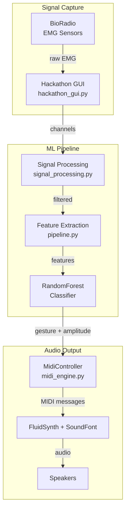
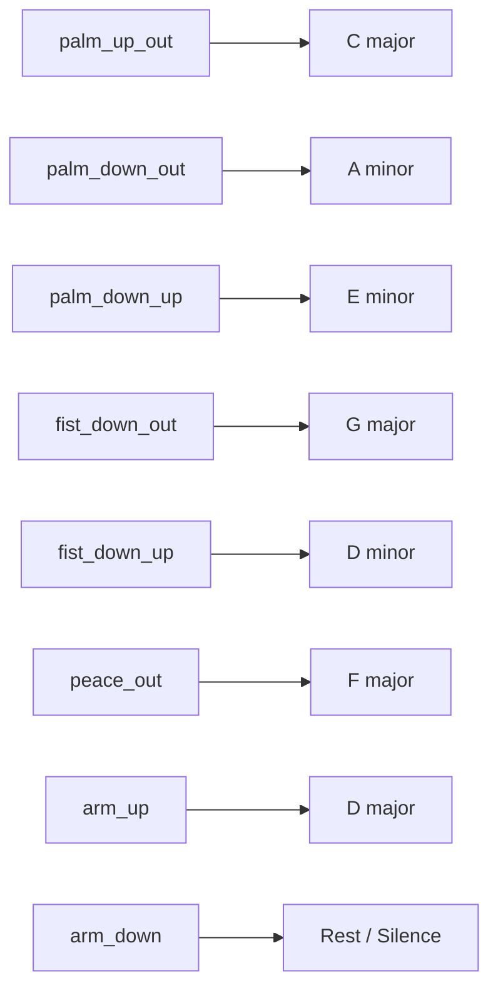
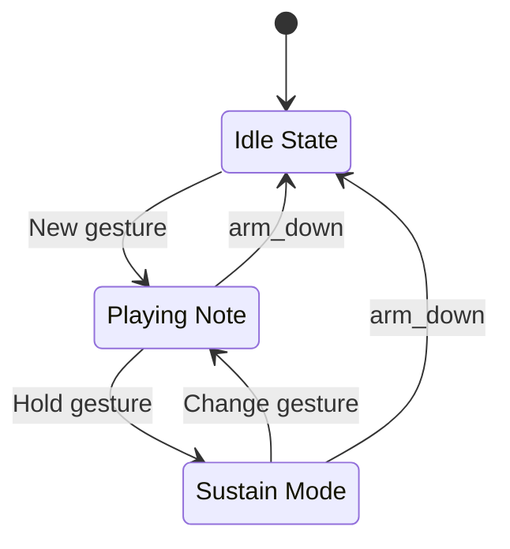

# :material-sitemap: Architecture

## System overview

---

## Signal flow

| Stage | File | What it does |
|-------|------|-------------|
| **Capture** | `hackathon_gui.py` | Streams raw EMG from BioRadio (or mock data) |
| **Preprocessing** | `pipeline.py` | Bandpass filter (20-450 Hz) + 60 Hz notch filter |
| **Feature extraction** | `pipeline.py` | Sliding window: RMS, MAV, Variance, Waveform Length, Zero Crossings |
| **Classification** | `pipeline.py` | RandomForestClassifier trained on 8 gesture classes |
| **Music synthesis** | `midi_engine.py` | Maps gestures to chords/instruments, renders audio via FluidSynth |

---

## Gesture mapping

### Right hand — chord selection

### Left hand — instrument selection

| Gesture | Instrument |
|---------|-----------|
| `fist_down_out` | Piano |
| `palm_up_out` | Nylon Guitar |
| `palm_down_out` | Steel Guitar |
| `palm_down_up` | Electric Guitar |
| `fist_down_up` | Strings |
| `peace_out` | Pad (Warm) |
| `arm_up` | Nylon Guitar |
| `arm_down` | Nylon Guitar |

---

## MIDI engine internals

The state machine debounces noisy classifier output (default: 3 consecutive frames) and handles chord transitions (note-off before note-on). EMG amplitude maps to MIDI velocity (louder flex = louder note).

---

## Key files

| File | Purpose |
|------|---------|
| `src/midi_engine.py` | MIDI engine: state machine, controller, playlist loader |
| `src/pipeline.py` | ML pipeline: preprocessing, features, classifier |
| `src/hackathon_gui.py` | GUI for BioRadio streaming and data collection |
| `src/signal_processing.py` | Signal processing utilities |
| `playlist/*.json` | Song chord progressions |
| `soundfonts/GeneralUser_GS.sf2` | SoundFont for FluidSynth (~30 MB) |
